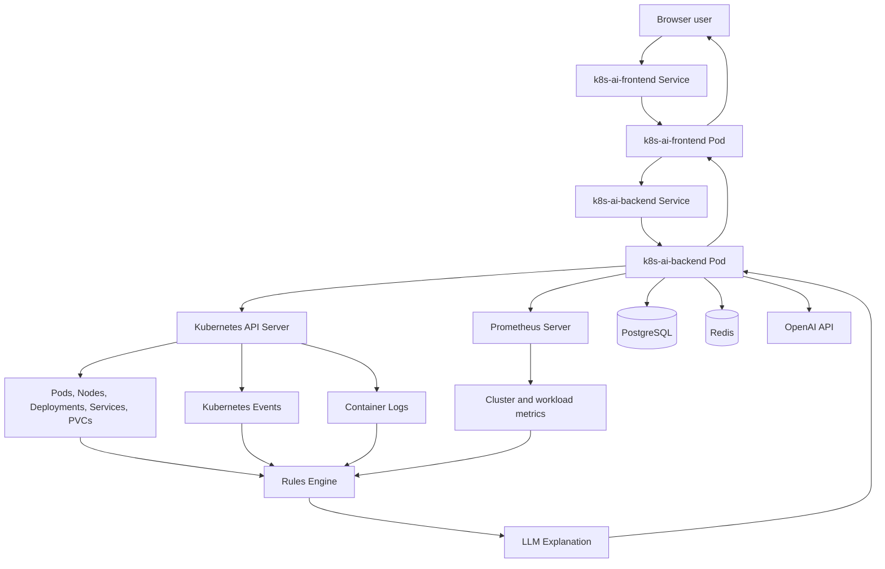
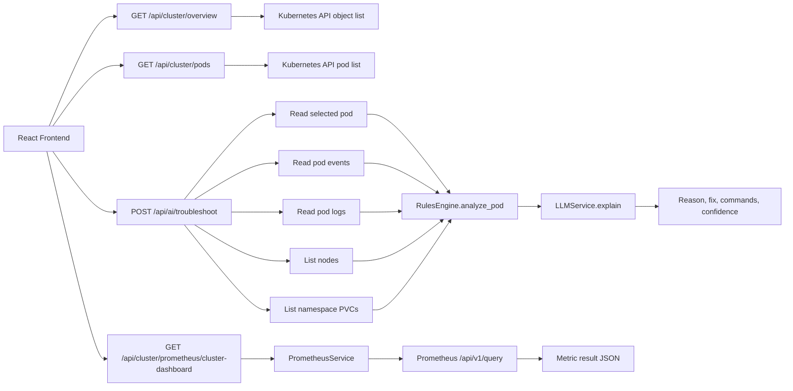
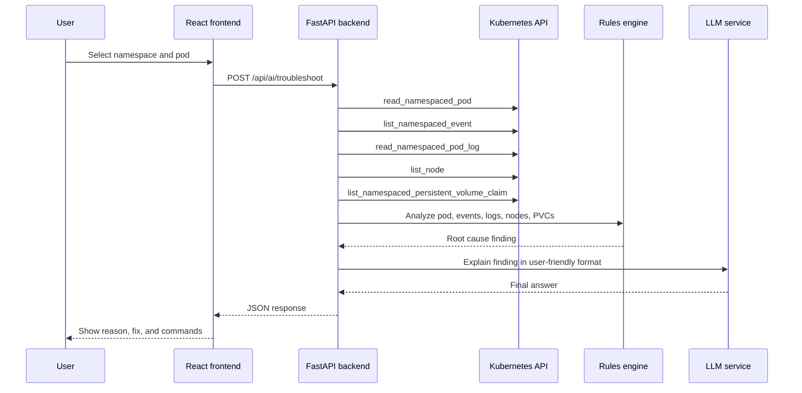
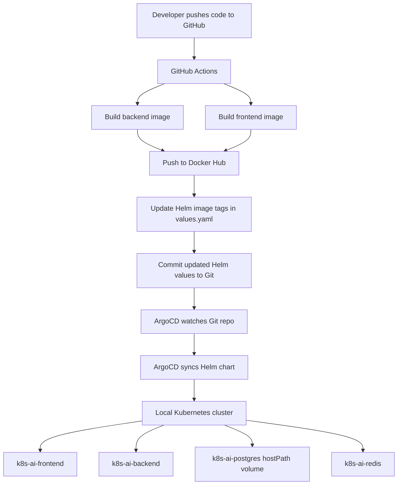
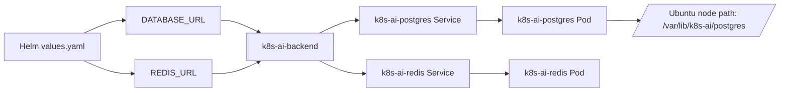

# Observability and Application Flow

This document shows how the application works end to end and how it collects
logs, metrics, Kubernetes events, cluster object status, and application data.

## High Level Flow



## Data Collection Flow



## Troubleshooting Request Sequence



## Deployment Flow With ArgoCD



## Database And Cache Flow



PostgreSQL currently uses `hostPath` by default for local Kubernetes clusters.
That avoids the error where a pod stays pending because no default
`StorageClass` exists.

## What Collects What

| Data type | Current source | Current code path | Notes |
|---|---|---|---|
| Pod status | Kubernetes API | `backend/app/services/k8s_client.py` -> `get_pod`, `list_pods` | Used by overview and troubleshooting |
| Node status | Kubernetes API | `backend/app/services/k8s_client.py` -> `list_nodes` | Used by overview and troubleshooting |
| Deployments | Kubernetes API | `backend/app/services/k8s_client.py` -> `list_deployments` | Used by overview |
| Services | Kubernetes API | `backend/app/services/k8s_client.py` -> `list_services` | Used by overview |
| PVC status | Kubernetes API | `backend/app/services/k8s_client.py` -> `list_pvcs` | Used for Pending pod and storage issues |
| Kubernetes events | Kubernetes API | `backend/app/services/k8s_client.py` -> `get_pod_events` | Used by rules engine |
| Container logs | Kubernetes API | `backend/app/services/k8s_client.py` -> `get_pod_logs` | Reads current pod logs directly from Kubernetes |
| Metrics | Prometheus API | `backend/app/services/prometheus.py` | Exposed for cluster, node, pod, networking, and CoreDNS dashboard data |
| AI explanation | LLM service | `backend/app/services/llm.py` | Explains rule output |
| Database | PostgreSQL | Helm `DATABASE_URL` env var | Configured, but incident-history persistence is still a future improvement |
| Cache or queue | Redis | Helm `REDIS_URL` env var | Configured for future background jobs/cache |
| Central log store | Loki | Helm `LOKI_URL` env var | Configured as env only; backend Loki collection is not implemented yet |

## Important Current Behavior

- Logs are not collected from Prometheus.
- Kubernetes events are not collected from Prometheus.
- Prometheus is used for metrics queries only.
- The main implemented Prometheus monitoring endpoint is:

```text
GET /api/cluster/prometheus/cluster-dashboard
```

The backend reads `PROMETHEUS_URL` first, then falls back through common
in-cluster Prometheus service names. You can also set `PROMETHEUS_URLS` to a
comma-separated list when your Prometheus service uses a custom name.

- The main troubleshooting endpoint is:

```text
POST /api/ai/troubleshoot
```

It collects pod status, pod events, pod logs, nodes, and PVCs, then sends that
data to the rules engine and LLM explanation service.

## Verify Data Sources In The Cluster

Check application pods:

```bash
kubectl get pods -n k8s-ai
```

Check backend logs:

```bash
kubectl logs -n k8s-ai deployment/k8s-ai-backend
```

Check Kubernetes events:

```bash
kubectl get events -A --sort-by=.lastTimestamp
```

Check Prometheus pod and service:

```bash
kubectl get pods -n monitoring
kubectl get svc -n monitoring
```

Check whether the backend can reach Prometheus:

```bash
kubectl exec -n k8s-ai deployment/k8s-ai-backend -- env | grep PROMETHEUS_URL
```

Check PostgreSQL hostPath data on the Ubuntu node:

```bash
sudo ls -lah /var/lib/k8s-ai/postgres
```
